# WeRent Frontend Documentation

This document provides information about the Frontend implementation of the WeRent car rental application.

## Technology Stack

- **Framework**: React + Vite
- **Styling**: CSS, Tailwindcss
- **State Management**: React Context API
- **Router**: React Router DOM

## Project Structure

```
FrontEnd/
├── public/                # Public assets
├── src/
│   ├── assets/           # Images and static assets
│   ├── components/       # Reusable components
│   │   ├── Banner.jsx
│   │   ├── CarCard.jsx
│   │   ├── FeaturedSection.jsx
│   │   ├── Footer.jsx
│   │   ├── Hero.jsx
│   │   ├── Loader.jsx
│   │   ├── Login.jsx
│   │   ├── Navbar.jsx
│   │   ├── NewsLetter.jsx
│   │   ├── Testimonial.jsx
│   │   ├── Title.jsx
│   │   └── owner/       # Owner-specific components
│   │       ├── NavbarOwner.jsx
│   │       ├── Sidebar.jsx
│   │       └── Title.jsx
│   ├── pages/           # Page components
│   │   ├── CarDetails.jsx
│   │   ├── Cars.jsx
│   │   ├── Home.jsx
│   │   ├── MyBookings.jsx
│   │   └── owner/      # Owner dashboard pages
│   │       ├── AddCar.jsx
│   │       ├── Dashboard.jsx
│   │       ├── Layout.jsx
│   │       └── ManageCars.jsx
│   ├── App.jsx         # Main application component
│   ├── index.css       # Global styles
│   └── main.jsx        # Application entry point
├── index.html
├── package.json
└── vite.config.js
```

## Components

### General Components

1. **Navbar.jsx**
   - Main navigation bar for regular users
   - Contains links to Home, Cars, Bookings, and Login/Register

2. **CarCard.jsx**
   - Reusable card component for displaying car information
   - Shows car image, name, price, and booking options

3. **Login.jsx**
   - Handles user authentication
   - Supports both login and registration

4. **Hero.jsx**
   - Landing page hero section
   - Features search functionality for cars

### Owner Dashboard Components

1. **NavbarOwner.jsx**
   - Navigation bar for car owners
   - Access to dashboard features

2. **Sidebar.jsx**
   - Dashboard navigation sidebar
   - Links to manage cars, bookings, and profile

## Pages

### User Pages

1. **Home.jsx**
   - Landing page with hero section
   - Featured cars section
   - Testimonials
   - Newsletter subscription

2. **Cars.jsx**
   - Lists all available cars
   - Filtering options by location and date
   - Search functionality

3. **CarDetails.jsx**
   - Detailed view of a specific car
   - Booking form
   - Car specifications and images

4. **MyBookings.jsx**
   - Lists user's current and past bookings
   - Booking status and details

### Owner Pages

1. **Dashboard.jsx**
   - Overview of owner's statistics
   - Recent bookings
   - Total earnings
   - Number of cars listed

2. **AddCar.jsx**
   - Form to add new car listings
   - Image upload
   - Car details input

3. **ManageCars.jsx**
   - List of owner's cars
   - Toggle availability
   - Edit/Delete cars

4. **ManageBookings.jsx**
   - View and manage booking requests
   - Accept/Reject bookings
   - Booking history

## Features

### User Features
- Search cars by location and date
- Filter cars by price range
- Book cars for specific dates
- View booking history
- User profile management
- Registration and login

### Owner Features
- Dashboard with statistics
- Add and manage car listings
- Handle booking requests
- View earnings
- Profile management
- Toggle car availability

## Getting Started

1. **Installation**
   ```bash
   cd FrontEnd
   npm install
   ```

2. **Development**
   ```bash
   npm run dev
   ```

3. **Build**
   ```bash
   npm run build
   ```

## API Integration

The frontend communicates with the backend API using the following services:

1. **Authentication**
   - Register: POST `/api/user/register`
   - Login: POST `/api/user/login`
   - Get User Data: GET `/api/user/data`

2. **Cars**
   - Get All Cars: GET `/api/cars`
   - Get Car Details: GET `/api/cars/:id`
   - Add Car: POST `/api/owner/add-car`
   - Update Car: PUT `/api/owner/cars/:id`

3. **Bookings**
   - Create Booking: POST `/api/booking/create`
   - Get User Bookings: GET `/api/booking/user`
   - Get Owner Bookings: GET `/api/booking/owner`

## State Management

The application uses React Context API for state management with the following contexts:

1. **AuthContext**
   - User authentication state
   - Login/Logout functions
   - User data

2. **BookingContext**
   - Booking related state
   - Booking functions
   - Search parameters

## Routing

The application uses React Router for navigation with protected routes for authenticated users and owners:


**Public Routes**

  - `/`       =>          Home page
      <p align='center'>
      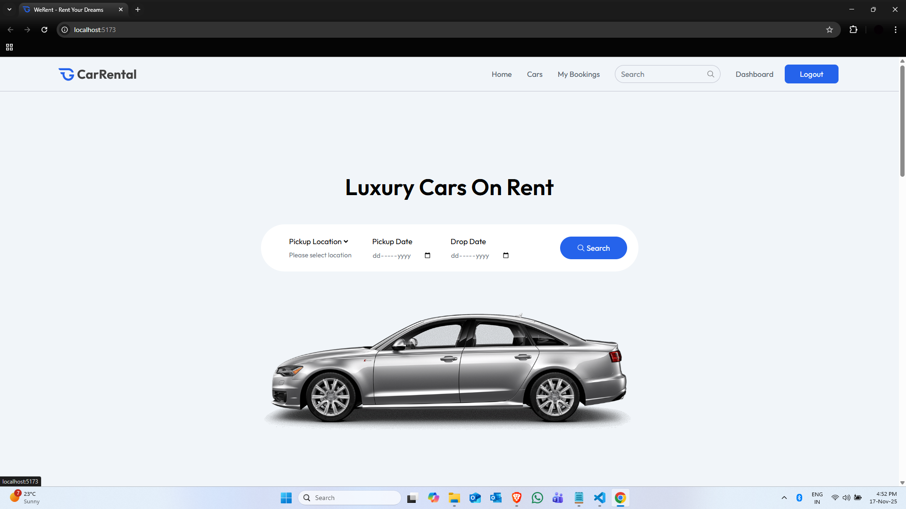
      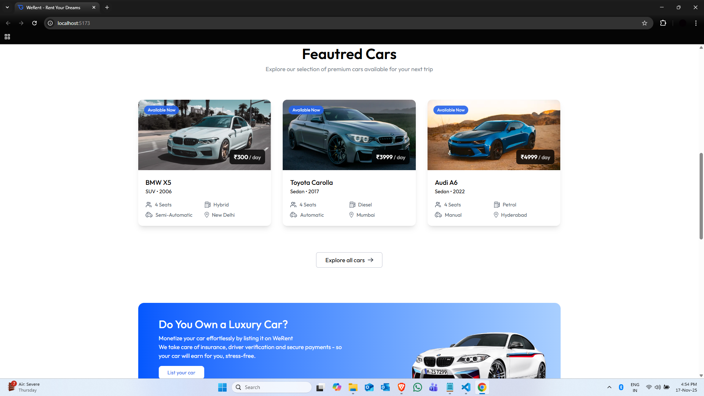
      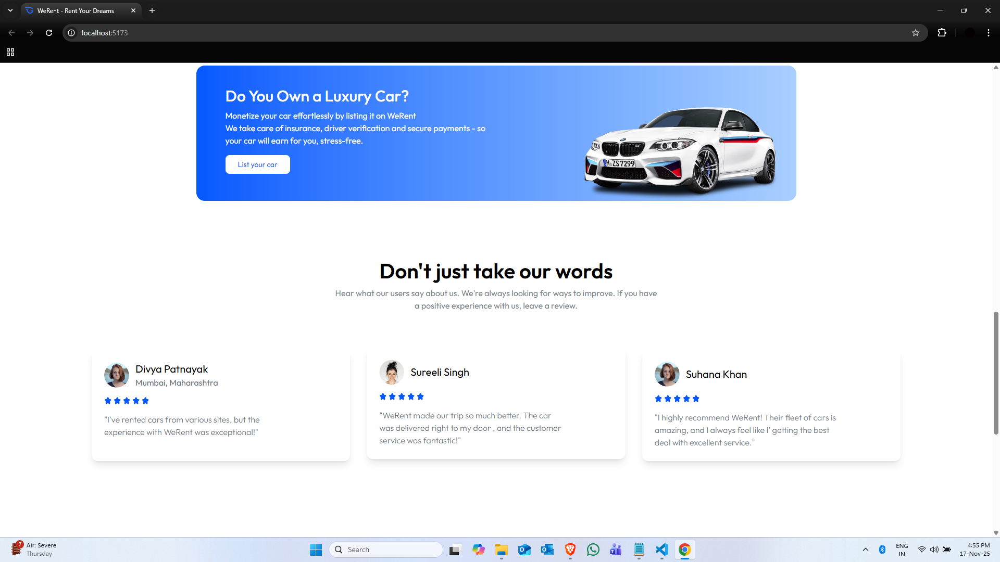
      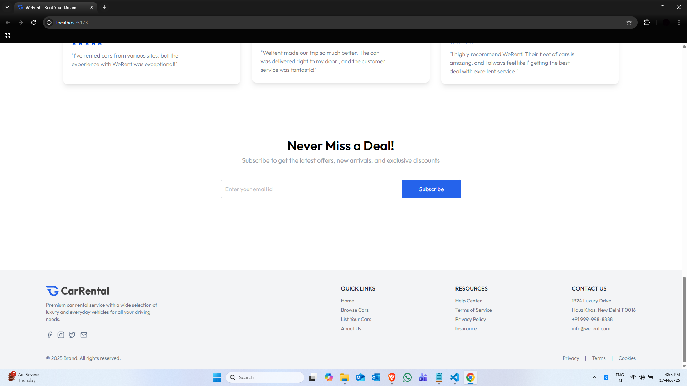
      </p>
  - `/cars`      =>      Car listings
      <p align='center'>
      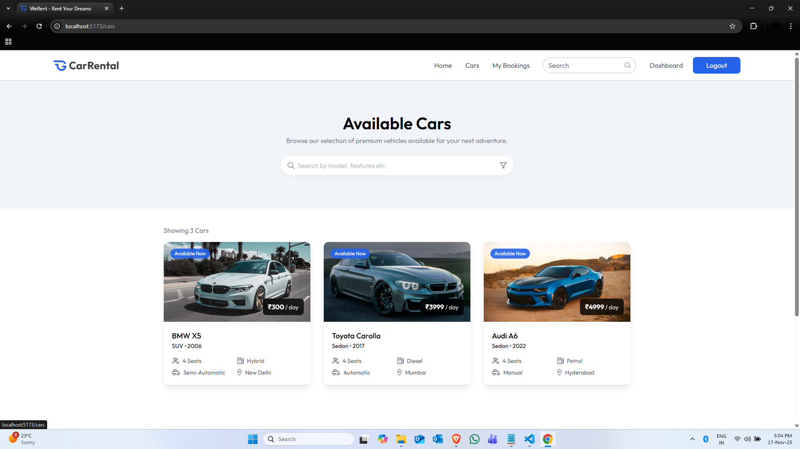
      </p>

  - `/car/:id`        => Car details
      <p align='center'>
      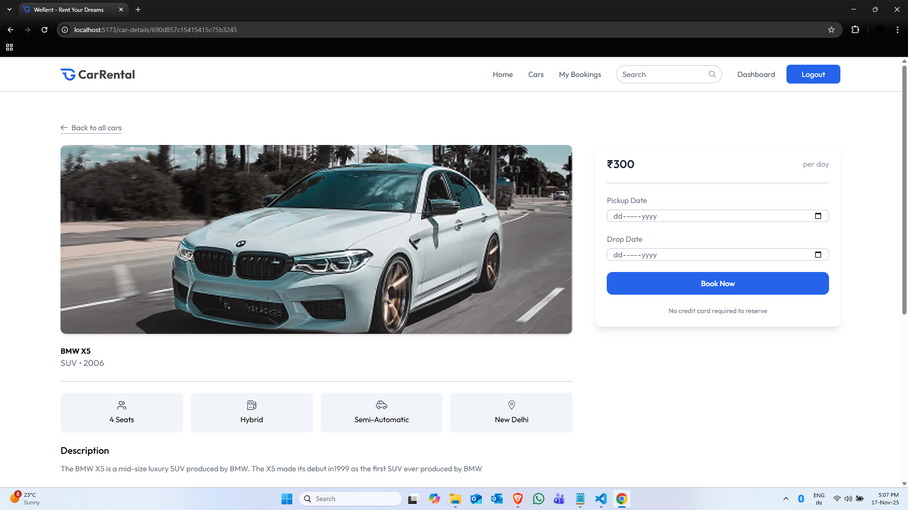
      </p>
  - `/login`          => Login/Register
      <p align='center'>
      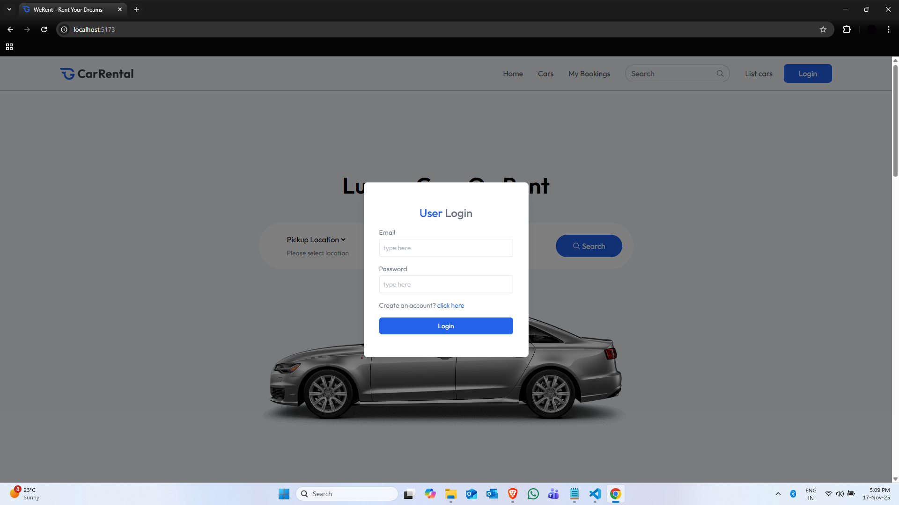
      
      </p>

**Protected User Routes**

 - `/bookings `      => User's bookings
      <p align='center'>
      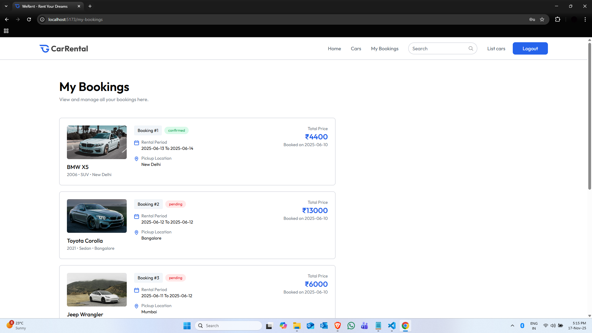
      </p>

**Protected Owner Routes**

 - `/owner `       => Owner dashboard
      <p align='center'>
      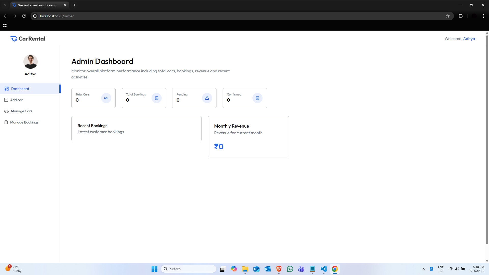
      </p>
 - `/owner/add-car `        => Add new car
      <p align='center'>
      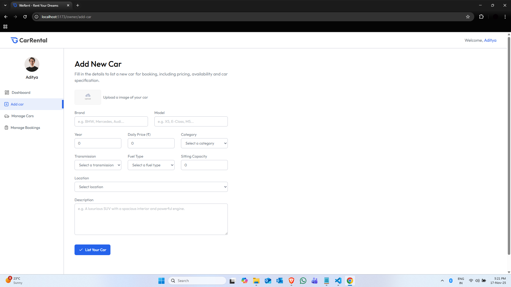
      </p>
 - `/owner/manage-cars`        => Manage cars
      <p align='center'>
      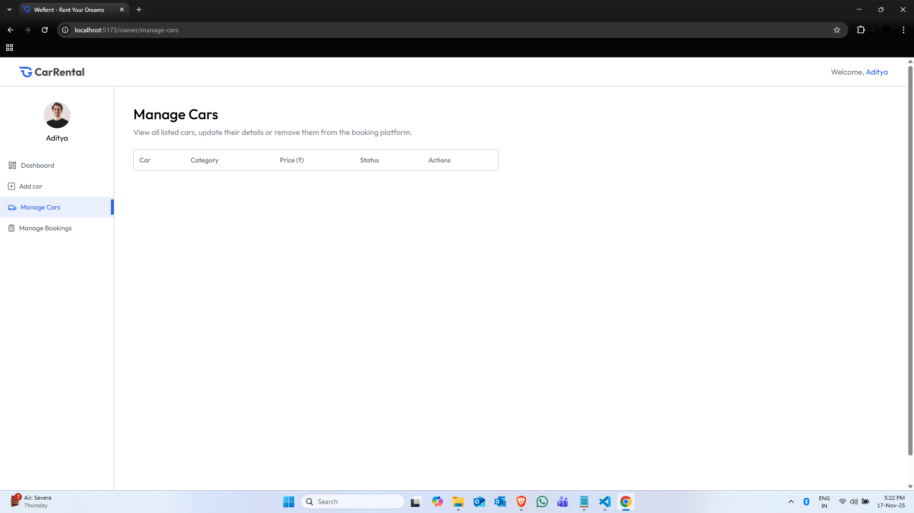
      </p>
 - `/owner/manage-bookings `       => Manage bookings
      <p align='center'>
      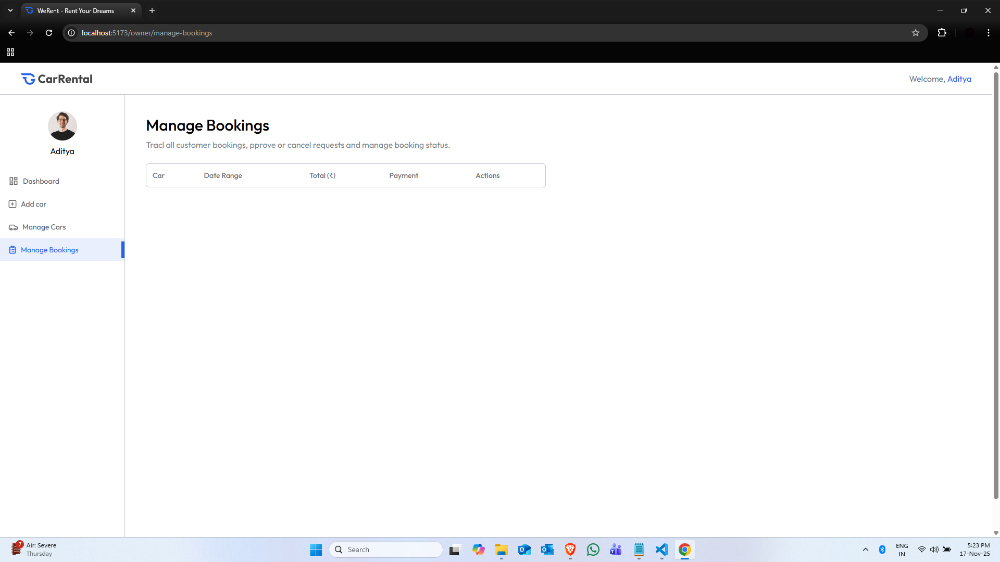
      </p>


## Responsive Design

The application is fully responsive with breakpoints:
- Mobile: < 768px
- Tablet: 768px - 1024px
- Desktop: > 1024px

## Scripts

The `FrontEnd/package.json` includes the usual scripts. Run them from the `FrontEnd` folder.

```powershell
npm run dev      
npm run build    
npm run preview  
```

If you use `pnpm` or `yarn` swap the command accordingly.

## Running the Frontend with the Backend

1. Start the backend (from `BackEnd`):

```powershell
cd ..\BackEnd
npm install
npm run dev 
```

2. Start the frontend (from `FrontEnd`):

```powershell
cd ..\FrontEnd
npm install
npm run dev
```

Open the dev URL printed by Vite (usually `http://localhost:5173`). The frontend will call the API at `VITE_API_URL`.

## AuthContext (shape & example)

The app uses a React Context for authentication. A minimal `AuthContext` shape looks like:

```javascript
// AuthContext value
{
   user: null | { _id, name, email, role, image },
   token: null | string,
   login: async (email, password) => { /* calls POST /api/user/login */ },
   register: async (data) => { /* calls POST /api/user/register */ },
   logout: () => { /* clears token & user */ },
   fetchUser: async () => { /* GET /api/user/data */ }
}
```

Use `Authorization` header for protected requests:

```
Authorization: <token>
```

## API Usage Examples

Below are short examples for commonly used API calls.

1) Login (fetch)

```javascript
const res = await fetch(`${import.meta.env.VITE_API_URL}/user/login`, {
   method: 'POST',
   headers: { 'Content-Type': 'application/json' },
   body: JSON.stringify({ email, password })
});
const json = await res.json();
if (json.success) localStorage.setItem('token', json.token);
```

2) Get available cars (fetch)

```javascript
const res = await fetch(`${import.meta.env.VITE_API_URL}/cars`);
const { cars } = await res.json();
```

3) Create booking (fetch, authenticated)

```javascript
const token = localStorage.getItem('token');
await fetch(`${import.meta.env.VITE_API_URL}/booking/create`, {
   method: 'POST',
   headers: {
      'Content-Type': 'application/json',
      'Authorization': token
   },
   body: JSON.stringify({ car: carId, pickupDate, dropDate })
});
```


## Component Props Examples

Here are common props for key components to make integration easier.

- `CarCard` props

```javascript
<CarCard
   car={{ _id, name, model, pricePerDay, image, location, isAvailable }}
   onBook={(carId) => { /* open booking modal */ }}
/>
```

- `Login` props

```javascript
<Login onSuccess={(tokenOrUser) => { /* set auth state */ }} />
```

## Deployment

Build the production bundle and serve it with any static server or deploy to Vercel/Netlify:

```powershell
cd FrontEnd
npm run build

```

When deploying, set `VITE_API_URL` to the production backend URL.

##  Contributing
PRs are welcome!  
For major changes, please open an issue first to discuss what you would like to change.


##  Connect With Me
- **LinkedIn:** https://www.linkedin.com/in/aditya-sing-dev/  
- **GitHub:** https://github.com/ADI-2707  
